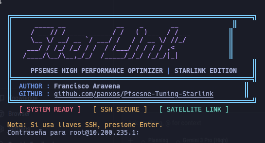
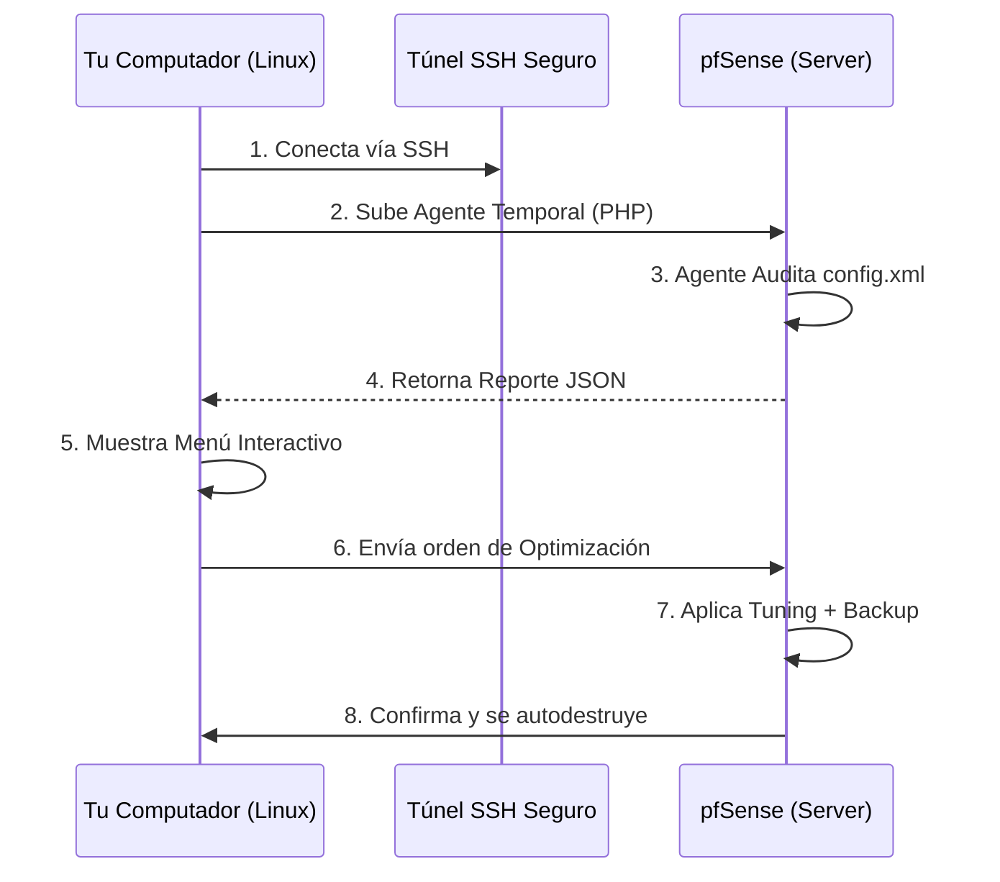

# 📡 pfSense Starlink Tuner - Edición Profesional

[](https://www.pfsense.org/)
[](https://www.python.org/)
[](https://www.php.net/)
[](LICENSE)



> **Herramienta Profesional de Auditoría, Optimización y Tuning para conexiones Starlink en pfSense.**  
> *Desbloquea el verdadero potencial de tu conexión satelital.*

---

```text
╔══════════════════════════════════════════════════════════════╗
║   _____ __             __    _       __                 ║
║  / ___// /_____ ______/ /   (_)___  / /___             ║
║  \__ \/ __/ __ `/ ___/ /   / / __ \/ //_/              ║
║ ___/ / /_/ /_/ / /  / /___/ / / / / ,<                 ║
║/____/\__/\__,_/_/  /_____/_/_/ /_/_/|_|                ║
║                                                              ║
║     PFSENSE HIGH PERFORMANCE OPTIMIZER | STARLINK EDITION    ║
╠══════════════════════════════════════════════════════════════╣
║  AUTHOR : Francisco Aravena                                ║
║  GITHUB : github.com/panxos/Pfsesne-Tuning-Starlink        ║
╚══════════════════════════════════════════════════════════════╝
```

---

## 🇪🇸 Documentación en Español

### 🚀 Descripción del Proyecto

Esta herramienta es una solución de ingeniería avanzada diseñada para resolver los problemas comunes al usar **Starlink** con routers **pfSense**.

A diferencia de las conexiones de fibra óptica, Starlink tiene características únicas:

1. **Latencia Variable**: La señal viaja al espacio, lo que requiere buffers TCP más grandes.
2. **Micro-cortes**: Cambios de satélite pueden causar pérdidas de señal de milisegundos.
3. **CGNAT**: Uso de direcciones IP compartidas.

Este software audita su configuración actual y aplica parches científicos al kernel de FreeBSD (sistema base de pfSense) para mitigar estos problemas, logrando una conexión estable y de alta velocidad.

### ⚙️ Arquitectura Técnica

El sistema usa un modelo **Cliente-Agente Efímero** para máxima seguridad. No se instala nada permanente en su router.



### 🔥 Características Principales

* **🛡️ Auditoría No-Intrusiva**: Escanea su router y le da una calificación de 0 a 100 basada en las mejores prácticas.
* **⚡ Optimización de Kernel (Sysctl)**: Ajusta matemáticamente los buffers de red (`recvbuf`, `sendbuf`) para compensar la latencia satelital.
* **🔌 Corrección de Interfaz WAN**: Soluciona el bug de "Pérdida de IP" cuando Starlink sufre micro-cortes, rechazando leases DHCP falsos (`192.168.100.1`).
* **🚀 Modo ULTRA (Exclusivo)**: Activa configuraciones de arranque (`loader.conf`) para soportar anchos de banda superiores a 1Gbps y cargas masivas de usuarios.
* **💾 Seguridad Total**:
  * **Backup Automático**: Descarga una copia de su configuración a su PC antes de tocar nada.
  * **Rollback**: Opción de deshacer cambios con un solo clic.

### 🛠️ Manual de Uso

#### 1. Instalación

Clone el repositorio en su máquina Linux (Kali, Ubuntu, Debian, etc.):

```bash
git clone https://github.com/panxos/Pfsesne-Tuning-Starlink.git
cd Pfsesne-Tuning-Starlink
```

#### 2. Ejecución

Ejecute el script apuntando a la IP de su pfSense:

```bash
# Si usa contraseña:
./Pfsesne-Tuning-Starlink.py --host 192.168.1.1 --user root

# Si usa llaves SSH (Recomendado):
./Pfsesne-Tuning-Starlink.py --host 192.168.1.1 --user root --key ~/.ssh/id_rsa
```

#### 3. Menú Interactivo

Verá una interfaz profesional. Seleccione **Opción 1** para auditar y **Opción 3** para aplicar las correcciones estándar. Use la **Opción 5 (Ultra)** solo si busca rendimiento extremo.

---

## 🇺🇸 English Documentation

### 🚀 Overview

**pfSense Starlink Tuner** is a professional-grade automation tool designed to optimize pfSense routers specifically for **Starlink** internet connections.

Standard router configurations are designed for low-latency fiber. Starlink's satellite nature requires specific kernel tunings to handle:

* **High Bandwidth Delay Product (BDP)**.
* **CGNAT traversal**.
* **DHCP stability** during satellite handovers.

This tool acts as a specialized mechanic for your router, applying verified engineering fixes to ensure maximum stability and throughput.

### 🔥 Key Features

1. **Agentless Architecture**: Pushes a temporary PHP agent over SSH. Zero footprint left on the firewall.
2. **Safety First**: Automatically downloads a local backup of `config.xml` before applying changes.
3. **Kernel Optimization**: Tunes FreeBSD `sysctl` parameters to allow larger TCP windows (essential for satellite speeds).
4. **Wan Stability Fix**: Prevents the interface from hanging onto the temporary `192.168.100.x` address during reliable satellite outages.
5. **Ultra Mode**: Deep boot-time optimization (`loader.conf`) for enterprise-grade throughput (Requires Reboot).

### 🛠️ Quick Start

```bash
git clone https://github.com/panxos/Pfsesne-Tuning-Starlink.git
cd Pfsesne-Tuning-Starlink
./Pfsesne-Tuning-Starlink.py --host <PFSENSE_IP> --user root
```

---

## 🔧 Technical Tuning Details / Detalle Técnico

| Parameter | Value | Impact |
| :--- | :--- | :--- |
| `net.inet.tcp.recvbuf_max` | `4MB` | Maximizes download speed over high latency. |
| `net.inet.tcp.sendbuf_max` | `4MB` | Maximizes upload speed for cloud backups. |
| `net.inet.ip.intr_queue_maxlen`| `2048` | Prevents packet loss during traffic bursts. |
| `wan_reject_leases` | `192.168.100.1` | Prevents WAN lockout during dish reboots. |
| `kern.ipc.maxsockbuf` (Ultra) | `16MB` | Enables massive concurrency for +100 users. |

---

> **Disclaimer**: This software modifies system configurations. Always maintain a backup.  
> **Author**: Francisco Aravena | **GitHub**: [panxos](https://github.com/panxos)
