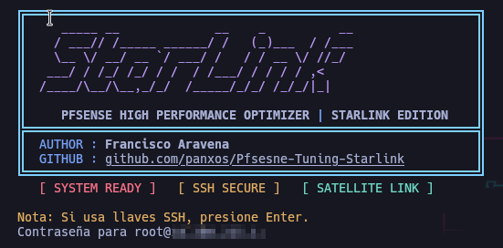

# 🛰️ pfSense Starlink Tuner - Professional Edition


**Herramienta profesional para optimizar pfSense en conexiones Starlink**

[](https://opensource.org/licenses/MIT)
[](https://www.python.org/downloads/)
[](https://www.pfsense.org/)

---

## 📸 Vista Previa



---

## 🚀 Características

- **🔍 Auditoría de Configuración**: Verifica optimizaciones específicas para Starlink
- **🛡️ Escaneo de Seguridad**: Detecta vulnerabilidades y malas prácticas
- **⚡ Optimización Automática**: Aplica tunables de red para alta latencia/ancho de banda
- **🔙 Rollback Seguro**: Backup automático antes de cada cambio
- **📊 Reportes Visuales**: Indicadores claros con puntuación de optimización

---

## 📋 Requisitos

### En tu PC (Cliente)

- Python 3.8+
- `sshpass` instalado (`sudo apt install sshpass`)
- Acceso SSH al pfSense

### En pfSense (Servidor)

- pfSense 2.7+ o CE 2.8+
- SSH habilitado
- Usuario con privilegios root/admin

---

## 🛠️ Instalación

```bash
# Clonar repositorio
git clone https://github.com/panxos/Pfsesne-Tuning-Starlink.git
cd Pfsesne-Tuning-Starlink

# Dar permisos de ejecución
chmod +x Pfsesne-Tuning-Starlink.py
```

---

## 🖥️ Uso

```bash
# Ejecutar con IP y usuario
./Pfsesne-Tuning-Starlink.py --host 192.168.1.1 --user root

# Con contraseña directa (menos seguro, solo para pruebas)
./Pfsesne-Tuning-Starlink.py --host 192.168.1.1 --user root --password TuClave
```

### Opciones del Menú

| Opción | Descripción |
|--------|-------------|
| 1 | Auditar configuración (solo lectura) |
| 2 | Escaneo de seguridad básico |
| 3 | Aplicar optimizaciones (con backup) |
| 4 | Restaurar backup anterior |
| 5 | Modo ULTRA (modifica loader.conf) |
| 0 | Salir |

---

## ⚙️ Optimizaciones Aplicadas

### Tunables de Red (Sysctl)

| Parámetro | Valor | Descripción |
|-----------|-------|-------------|
| `net.inet.tcp.recvbuf_max` | 4194304 | Buffer de recepción TCP máximo |
| `net.inet.tcp.sendbuf_max` | 4194304 | Buffer de envío TCP máximo |
| `net.inet.tcp.recvbuf_inc` | 65536 | Incremento de buffer de recepción |
| `net.inet.tcp.sendbuf_inc` | 65536 | Incremento de buffer de envío |
| `net.inet.ip.intr_queue_maxlen` | 2048 | Cola de interrupciones IP |
| `net.inet.tcp.mssdflt` | 1460 | MSS por defecto |

### Configuración WAN (Starlink)

- ✅ Desactiva "Block private networks" (necesario para CGNAT 100.x.x.x)
- ✅ Añade "Reject Leases From" 192.168.100.1 (evita IP falsa en cortes)

---

## 🔒 Seguridad

El escaneo de seguridad verifica:

- Usuario `admin` por defecto
- Puerto SSH estándar (22)
- Puerto WebGUI estándar (80/443)
- Reglas "ANY" abiertas en WAN

---

## 📁 Estructura del Proyecto

```
Pfsesne-Tuning-Starlink/
├── Pfsesne-Tuning-Starlink.py  # Cliente principal (ejecutar este)
├── pfsense_agent.php            # Agente remoto (se sube automáticamente)
├── backups/                     # Backups locales de config.xml
├── images/
│   ├── starlink_banner.png
│   └── screenshot_app.png
└── README.md
```

---

## 👨‍💻 Autor

**Francisco Aravena**

- GitHub: [@panxos](https://github.com/panxos)

---

## 📄 Licencia

Este proyecto está bajo la Licencia MIT. Ver el archivo [LICENSE](LICENSE) para más detalles.

---

## ⭐ Contribuir

¡Las contribuciones son bienvenidas! Por favor, abre un issue o pull request.

1. Fork el proyecto
2. Crea tu rama de feature (`git checkout -b feature/AmazingFeature`)
3. Commit tus cambios (`git commit -m 'Add: nueva característica'`)
4. Push a la rama (`git push origin feature/AmazingFeature`)
5. Abre un Pull Request
